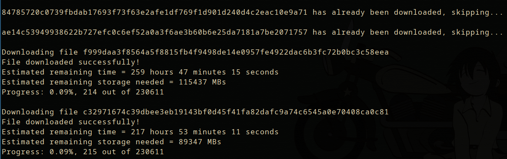

# Portal de Compras Publicas Scraper  

A script to download files from their server  

## Usage:  
`python download_licitacoes.py <editais.json>`  

This will download all files with the following directory structure:  

```
files
├─cd_licitacao_0
│  ├─file_id_0
│  └─file_id_1
│
└─cd_licitacao_1
   └─file_id_2
```

The file `confirmed_downloads.json` will also be generated, so you can  
start and stop the script at any time and it will continue from where it left off.  


## Screenshots:  
  
